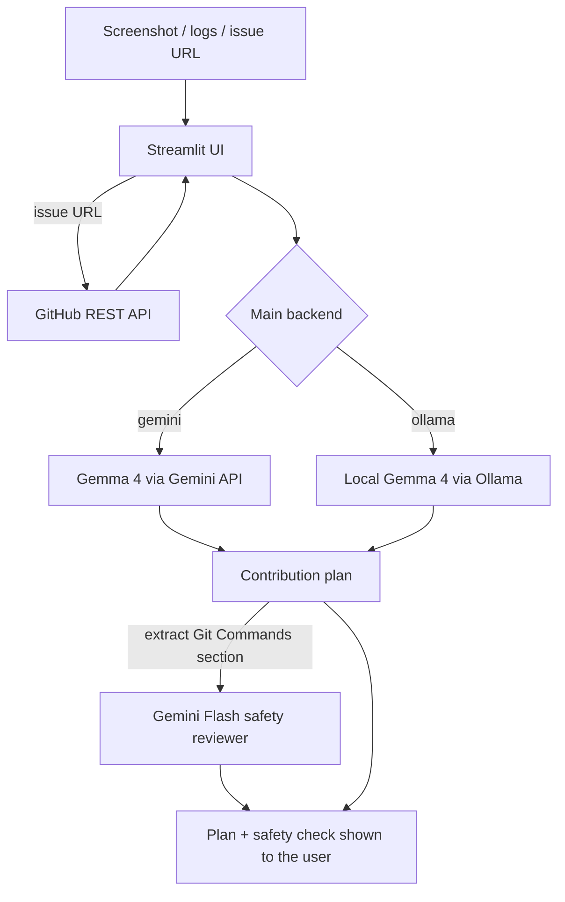

# 🚀 FirstPR Pilot

**An AI mentor that turns a bug report, error screenshot, or GitHub issue into your first open-source pull request.**

FirstPR Pilot reads what you give it (a screenshot, pasted logs, or a public GitHub issue URL) and replies with a plain-English explanation, the files to look at, a step-by-step fix plan, copy-pasteable Git commands, a Conventional Commit message, and a draft PR description. A second AI model then reviews the Git commands for beginner mistakes before you run them.

Built for **Hacktoberfest 2026**. Open-weight [Gemma 4](https://ai.google.dev/gemma) does the main thinking, and everything is MIT licensed.

## Hackathon challenges

| Challenge | How FirstPR Pilot qualifies |
|---|---|
| **Best Use of Gemma 4** | `gemma-4-26b-a4b-it` is the main mentor model. It takes **text and screenshots** (multimodal) through the Gemini API and produces a structured contribution plan. |
| **Best Use of Gemini API** | All cloud calls go through the Gemini API (`google-genai` SDK): Gemma 4 for the plan, plus a Gemini Flash model as a "second opinion" Git safety reviewer. |
| **Best Open-Source AI Project** | Open-weight Gemma 4 is the core of the app, with an optional **fully local backend** (Ollama) so it can run offline. Public repo, MIT license, and an [Agent Skills](https://agentskills.io)-format `SKILL.md` in `skills/firstpr-pilot/`. |

## How it works



The flow lives in `firstpr_pilot/pipeline.py`, with no UI code, so it is easy to test and reuse.

## Quick start

Requires Python 3.10+.

```bash
git clone https://github.com/Aakif-Kohari/firstpr-pilot.git
cd firstpr-pilot
python -m venv .venv
source .venv/bin/activate        # Windows: .venv\Scripts\activate
pip install -r requirements.txt
cp .env.example .env             # Windows: copy .env.example .env
# edit .env and set GEMINI_API_KEY (free key from https://aistudio.google.com)
streamlit run app.py
```

Open the URL Streamlit prints (usually http://localhost:8501).

## Usage

1. Upload a screenshot of an error or UI bug, and/or paste logs, and/or paste a public issue URL such as `https://github.com/owner/repo/issues/123`. You need at least one.
2. Click **Analyze and generate plan**.
3. Read the plan. It always has these sections: Plain-English Explanation, Likely Files/Areas, Step-by-Step Fix Plan, Git Commands, Draft Commit Message, Draft PR Description.
4. Check the **Git safety check** panel, then follow the commands to make your pull request.

## Configuration

Set these in `.env` (or the sidebar).

| Variable | Default | Purpose |
|---|---|---|
| `GEMINI_API_KEY` | none | Required for the `gemini` backend and the safety reviewer |
| `GEMMA_MODEL` | `gemma-4-26b-a4b-it` | Main model (`gemma-4-31b-it` also works) |
| `GEMINI_MODEL` | `gemini-2.5-flash` | Safety reviewer model |
| `BACKEND` | `gemini` | `gemini` or `ollama` |
| `OLLAMA_MODEL` | `gemma4:e4b` | Local model tag, used when `BACKEND=ollama` |
| `OLLAMA_URL` | `http://localhost:11434` | Ollama server address |
| `GITHUB_TOKEN` | none | Optional, raises the GitHub API rate limit |

### Run fully local with open weights

```bash
ollama pull gemma4:e4b
BACKEND=ollama streamlit run app.py
```

With the Ollama backend the main analysis never leaves your machine. The Gemini safety review only runs if `GEMINI_API_KEY` is set, and is skipped with a notice otherwise.

## Agent skill

`skills/firstpr-pilot/` is the same workflow packaged as an [Agent Skill](https://agentskills.io): a `SKILL.md` with the instructions plus `scripts/fetch_issue.py`, a dependency-free helper that fetches a GitHub issue. Copy the folder into any agent that supports the Agent Skills format.

## Project layout

```
app.py                      Streamlit UI
firstpr_pilot/
  pipeline.py               input validation -> plan -> safety review
  backends.py               Gemini API and Ollama backends
  github_issue.py           GitHub issue URL parsing and fetching
  prompts.py                prompts and Markdown section parsing
skills/firstpr-pilot/       Agent Skill (SKILL.md + script)
tests/                      pytest suite (no network or API key needed)
docs/ARCHITECTURE.md        design notes
```

## Development

```bash
pip install -r requirements-dev.txt
pytest
```

Tests use fakes for the AI backends and GitHub, so they run offline. CI runs them on Python 3.10 to 3.12.

## Troubleshooting

| Problem | Fix |
|---|---|
| "GEMINI_API_KEY is not set" | Add the key to `.env` or the sidebar |
| "quota or rate limit reached" | Wait a minute; free-tier limits apply |
| "model was not found" | Check `GEMMA_MODEL`; list models in Google AI Studio |
| "Could not connect to Ollama" | Start it with `ollama serve` and run `ollama pull gemma4:e4b` |
| "GitHub rate limit reached" | Set `GITHUB_TOKEN`, or paste the issue text instead |

## Limitations

- The model sees only what you give it, not your repository, so file suggestions are educated guesses. Always read the project's `CONTRIBUTING.md`.
- AI output can be wrong. The safety reviewer is a helpful second opinion, not a guarantee. Read every command before running it.
- Only public GitHub issues can be fetched.

## Contributing

Contributions are welcome and Hacktoberfest-friendly. See [CONTRIBUTING.md](CONTRIBUTING.md).

## License

[MIT](LICENSE) © 2026 Aakif Kohari
